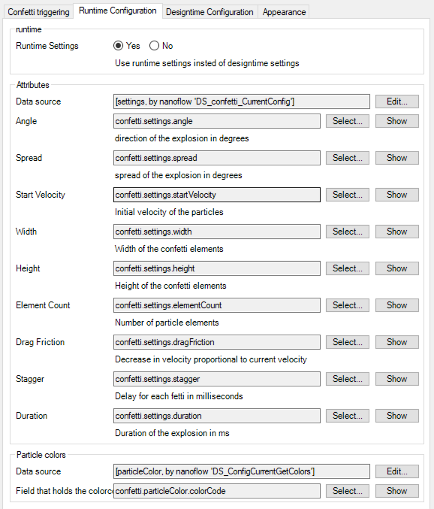

## Confetti

 The Confetti plugable widget wraps the react-dom-confetti component in a Mendix widget

## Features
- **Manual trigger**
    - If you don't want it to listen to a datasource
 set the trigger with button property to render a the component as a button. When you press the button, the confetti with trigger
- **Expression based trigger**
    - Make the component listen to an external condition by setting an expression
- **Design time configuration**
    - You can configure the behavioir of the confetti at designtime, include the confetti particle colors
- **Runtime configuration**
    - If you want to influence the behaviour of the confetti at runtime, hook it up to a datasource

## Usage
#### Manual standalone
1. Drag the component on a page
2. Make sure that `trigger with button` is set to **Yes**
3. Set a caption for the button [`default = 'Hit me'`]
4. Set a delay for the explosion [`default = '3000 ms'`]
5. Set a message for the button white couting down [`default = 'Loading...'`]
6. Set a button style
7. If you want another action when the confetti explodes, set the action in the `onclick` action

##### Manual triggered by an expression
1. Drag the component on a page
2. make sure that `trigger with button` is set to **No**
3. Enter an expression that results in a boolean, please note the following:
    - The confetti will trigger when this expressions transitions from false to true
    - The confetti will only trigger again when this expression has gone to false.

#### Design time configuration
1. Drag the component on a page
2. Open the properties
3. By default designtime configuration is enabled
4. Designtime properties are on the third tab
    - **Angle**: direction of the explosion in degrees, defaults to: `45`
    - **Spread**: spread of the explosion in degrees, defaults to: `45`
    - **Start Velocity**: Initial velocity of the particles, defaults to: `10`
    - **Width**: Width of the confetti elements defaults to: `10`
    - **Height**: Height of the confetti elements defaults to: `50`
    - **Element Count**: Number of particle elements, defaults to `50`.
    - **Drag Friction**: Decrease in velocity proportional to current velocity, default to `0.1` 
    - **Stagger:** Delay for each fetti in milliseconds, defaults to: `3000`
    - **Duration:** Duration of the explosion in ms. Defaults to `3000` 
    - **Colors for the particals:** Particle colors string, should be in the following format: `#123123, #456456, #789789`

#### Run time configuration
If you would like to set the configuration for a confetti at runtime, you can enable this aswell. The widget expects the following entity setup as a structure:

Settings is a list of settings, with a list of particle colors attached to it. For demo purposes each settings element also has a trigger entity.

To setup the runtime configuration as following:

**Things to keep in mind:**
    - Allthough a list of settings is passed to the widget, only the first element in the list is used. So be sure to pass a list with only one item
    - To pass the colorslist, a second datasource is used, this contains the list of colors
    - All fields need to be mapped

## Demo project
[link to sandbox]

## Issues, suggestions and feature requests
[link to GitHub issues]

## Development and contribution
- Build as demonstration by Willem Haring (Mendix)
- Based on [react-dom-confetti](https://github.com/daniel-lundin/react-dom-confetti) by Daniel Lundin

